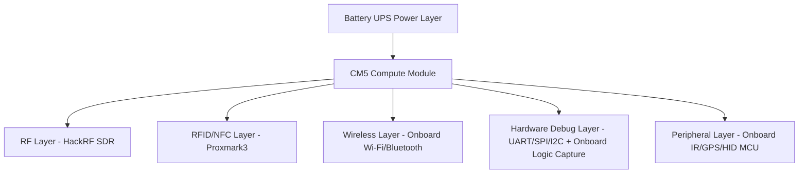
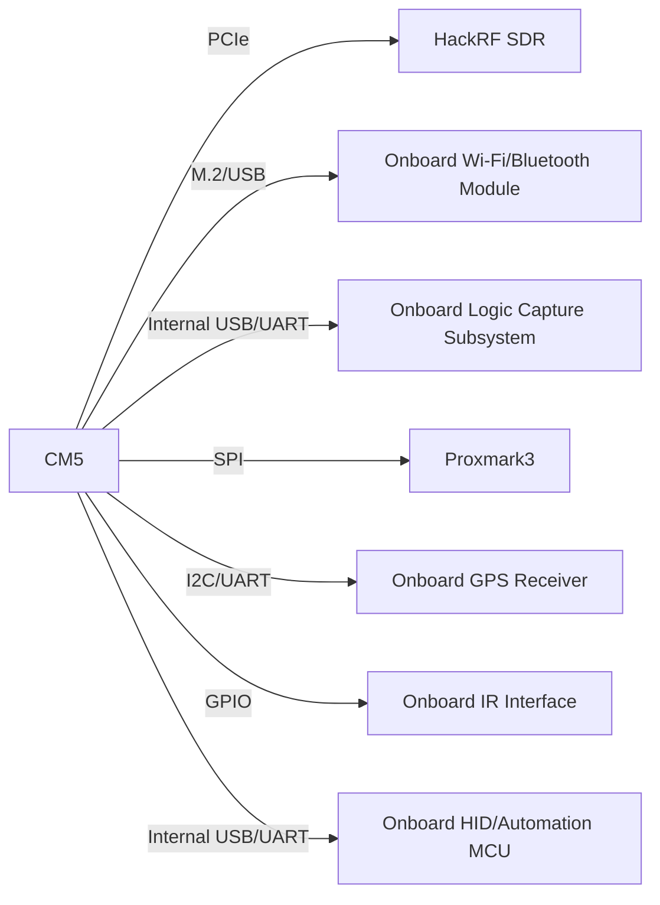

# Cyberdeck Research Workstation

[](#)
[](#)
[](#)
[](docs)

A modular portable cybersecurity and hardware research platform integrating RF analysis, wireless testing, RFID/NFC research, embedded debugging, and field-capable workflows.

---

## Why This Project

The Cyberdeck Research Workstation is designed as a **serious engineering platform** for real-world security research, not just a showcase build.

It combines:

- SDR and RF analysis
- wireless protocol research
- RFID/NFC tooling
- embedded interface debugging
- portable battery-backed operation

---

## Architecture Diagram



---

## Module Diagram



---

## Capability Snapshot

| Domain                    | Supported |
| ------------------------- | --------- |
| RF Research               | ✅        |
| Wireless Security         | ✅        |
| RFID / NFC                | ✅        |
| Hardware Debugging        | ✅        |
| IoT Security              | ✅        |
| Embedded Analysis         | ✅        |
| Infrared Protocol Testing | ✅        |
| Geolocation Research      | ✅        |

Detailed mapping is available in [docs/01_FOUNDATION/SECURITY_RESEARCH_CAPABILITIES.md](docs/01_FOUNDATION/SECURITY_RESEARCH_CAPABILITIES.md).

---

## Cyberdeck Render Mockups

Add your concept and build renders in `assets/` and reference them here:


Render workflow assets:

- [Render Batch Index](assets/renders/README.md)
- [BATCH-001 Prefilled Brief](assets/renders/BATCH-001/BRIEF.md)

---

## Roadmap Progress

- Phase 1 — Research and Planning: `██████████` 100%
- Phase 2 — Hardware Prototyping: `██████░░░░` 60%
- Phase 3 — Software Integration: `█████░░░░░` 50%
- Phase 4 — Field Testing: `██░░░░░░░░` 20%
- Phase 5 — Enclosure Design: `██░░░░░░░░` 20%
- Phase 6 — Advanced Features: `█░░░░░░░░░` 10%

Full roadmap: [docs/01_FOUNDATION/CYBERDECK_ROADMAP.md](docs/01_FOUNDATION/CYBERDECK_ROADMAP.md).

---

## Getting Started

1. Review architecture and module boundaries in [docs/01_FOUNDATION/SYSTEM_ARCHITECTURE.md](docs/01_FOUNDATION/SYSTEM_ARCHITECTURE.md).
2. Confirm electrical interfaces and bus assignments in [docs/02_HARDWARE/MODULE_INTERFACE_SPEC.md](docs/02_HARDWARE/MODULE_INTERFACE_SPEC.md).
3. Populate sourcing and costs in [docs/02_HARDWARE/BOM_TEMPLATE.md](docs/02_HARDWARE/BOM_TEMPLATE.md).
4. Execute bring-up validation using [docs/02_HARDWARE/HARDWARE_CHECKLIST.md](docs/02_HARDWARE/HARDWARE_CHECKLIST.md).
5. Track phase progress in [docs/01_FOUNDATION/CYBERDECK_ROADMAP.md](docs/01_FOUNDATION/CYBERDECK_ROADMAP.md).

Suggested first milestone:

- complete BOM v1 with core modules and alternates
- validate power rails and CM5 boot
- verify SDR, Wi-Fi monitor mode, and UART debug access

### Motherboard-First Decision (Removed External Components)

These standalone items are intentionally removed from baseline and replaced by onboard subsystems:

- external Wi-Fi adapter
- external Bluetooth sniffer dongle
- external USB-UART adapter
- external IR transceiver module
- external GPS breakout module
- external HID dev board

Still modular in v1:

- HackRF SDR
- Proxmark3
- optional external high-end logic analyzer (development only)

### No-Hardware Run Commands

```bash
bash software/scripts/bootstrap_macos.sh
bash software/scripts/verify_toolchain.sh
bash software/scripts/no_hardware_readiness.sh
```

Windows (PowerShell):

```powershell
powershell -ExecutionPolicy Bypass -File .\software\scripts\bootstrap_windows.ps1
powershell -ExecutionPolicy Bypass -File .\software\scripts\verify_toolchain_windows.ps1
powershell -ExecutionPolicy Bypass -File .\software\scripts\no_hardware_readiness_windows.ps1
```

Latest baseline result: [docs/artifacts/READINESS_BASELINE_2026-03-09.md](docs/artifacts/READINESS_BASELINE_2026-03-09.md)

---

## Documentation

- [Documentation Map (No-Overlap)](docs/00_DOCS_MAP.md)
- [System Architecture](docs/01_FOUNDATION/SYSTEM_ARCHITECTURE.md)
- [Hardware Design](docs/02_HARDWARE/HARDWARE_DESIGN.md)
- [Cyberdeck Roadmap](docs/01_FOUNDATION/CYBERDECK_ROADMAP.md)
- [Security Research Capabilities](docs/01_FOUNDATION/SECURITY_RESEARCH_CAPABILITIES.md)
- [Module Interface Specification](docs/02_HARDWARE/MODULE_INTERFACE_SPEC.md)
- [Motherboard v1 Full Specification](docs/02_HARDWARE/MOTHERBOARD_V1_SPEC.md)
- [Omnideck Visual Direction](docs/02_HARDWARE/OMNIDECK_VISUAL_DIRECTION.md)
- [Render Brief Template](docs/02_HARDWARE/RENDER_BRIEF_TEMPLATE.md)
- [BOM Template](docs/02_HARDWARE/BOM_TEMPLATE.md)
- [Hardware Bring-Up Checklist](docs/02_HARDWARE/HARDWARE_CHECKLIST.md)
- [No-Hardware Execution Plan](docs/03_EXECUTION/NO_HARDWARE_EXECUTION_PLAN.md)
- [Simulation Tooling Guide](docs/03_EXECUTION/SIMULATION_TOOLING_GUIDE.md)
- [Simulation Runbook](docs/03_EXECUTION/SIMULATION_RUNBOOK.md)
- [No-Hardware Execution Tracker](docs/03_EXECUTION/EXECUTION_TRACKER.md)
- [Procurement Tracker](docs/03_EXECUTION/PROCUREMENT_TRACKER.md)

## Software Assets

- [Script Overview](software/scripts/README.md)
- [Bootstrap Script (macOS)](software/scripts/bootstrap_macos.sh)
- [Bootstrap Script (Windows)](software/scripts/bootstrap_windows.ps1)
- [Toolchain Verification](software/scripts/verify_toolchain.sh)
- [Readiness Scoring Script](software/scripts/no_hardware_readiness.sh)
- [Toolchain Verification (Windows)](software/scripts/verify_toolchain_windows.ps1)
- [Readiness Scoring (Windows)](software/scripts/no_hardware_readiness_windows.ps1)
- [Example Toolchain Config](software/configs/toolchain.example.env)
- [No-Hardware Targets Config](software/configs/no_hardware_targets.yaml)

## Hardware Assets

- [KiCad Constraints Checklist](hardware/pcb/KICAD_CONSTRAINTS_CHECKLIST.md)
- [Netclass Template](hardware/pcb/NETCLASS_TEMPLATE.md)
- [Net Assignment Map](hardware/pcb/NET_ASSIGNMENT_MAP.md)
- [Pre-Fab Sign-Off Checklist](hardware/pcb/PRE_FAB_SIGNOFF.md)

---

## Repository Structure

```text
omnideck/
├── README.md
├── docs/
│   ├── 00_DOCS_MAP.md
│   ├── 01_FOUNDATION/
│   │   ├── SYSTEM_ARCHITECTURE.md
│   │   ├── SECURITY_RESEARCH_CAPABILITIES.md
│   │   └── CYBERDECK_ROADMAP.md
│   ├── 02_HARDWARE/
│   │   ├── HARDWARE_DESIGN.md
│   │   ├── MODULE_INTERFACE_SPEC.md
│   │   ├── MOTHERBOARD_V1_SPEC.md
│   │   ├── OMNIDECK_VISUAL_DIRECTION.md
│   │   ├── RENDER_BRIEF_TEMPLATE.md
│   │   ├── BOM_TEMPLATE.md
│   │   └── HARDWARE_CHECKLIST.md
│   ├── 03_EXECUTION/
│   │   ├── NO_HARDWARE_EXECUTION_PLAN.md
│   │   ├── SIMULATION_TOOLING_GUIDE.md
│   │   ├── SIMULATION_RUNBOOK.md
│   │   ├── EXECUTION_TRACKER.md
│   │   └── PROCUREMENT_TRACKER.md
│   └── artifacts/
│       └── READINESS_BASELINE_2026-03-09.md
├── hardware/
│   ├── pcb/
│   │   ├── KICAD_CONSTRAINTS_CHECKLIST.md
│   │   ├── NETCLASS_TEMPLATE.md
│   │   ├── NET_ASSIGNMENT_MAP.md
│   │   └── PRE_FAB_SIGNOFF.md
│   └── enclosure/
├── software/
│   ├── scripts/
│   │   ├── README.md
│   │   ├── bootstrap_macos.sh
│   │   ├── bootstrap_windows.ps1
│   │   ├── verify_toolchain.sh
│   │   ├── no_hardware_readiness.sh
│   │   ├── verify_toolchain_windows.ps1
│   │   └── no_hardware_readiness_windows.ps1
│   └── configs/
│       ├── toolchain.example.env
│       └── no_hardware_targets.yaml
└── assets/
```

---

## Notes

This platform is intended for legal and authorized security research, hardware analysis, and educational experimentation.
